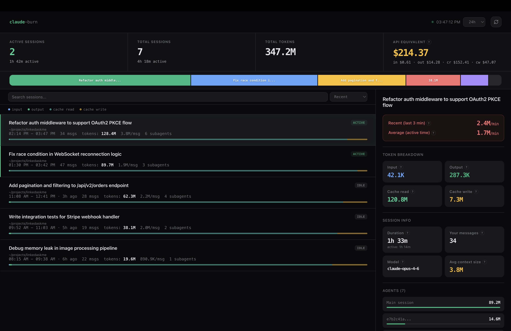

# claude-burn

See which Claude Code sessions are eating your tokens and how fast.

Zero dependencies. Reads local JSONL files. Nothing leaves your machine.



## Quick start

```bash
npx claude-burn
```

Opens a dashboard at `http://localhost:8787` with auto-refresh.

To install globally:

```bash
npm install -g claude-burn
claude-burn
```

## Features

- **Active session detection** — see which sessions are running right now
- **Token breakdown** — input, output, cache read, cache write per session
- **Burn rate** — recent (last 3 min) and average (active time) tokens/min
- **Active vs idle time** — excludes idle gaps from duration calculations
- **Subagent tracking** — token usage per agent with model info on hover
- **Session share bar** — proportional token distribution across sessions
- **API cost equivalent** — what your usage would cost at API pricing (per model)
- **Timeline chart** — cumulative token growth over time
- **Search and sort** — filter sessions by title, sort by recent/tokens/burn rate
- **Keyboard shortcuts** — `R` refresh, `J/K` navigate, `/` search, `1-7` time filter
- **Auto-refresh** — every 5s for 24h and under, manual for longer ranges

## Options

```
claude-burn [options]

--port <n>        Server port (default: 8787)
--data-dir <path> Claude data directory (default: ~/.claude/projects)
--no-open         Don't auto-open browser
--version, -v     Show version
--help, -h        Show help
```

## Keyboard shortcuts

| Key | Action |
|-----|--------|
| `R` | Refresh data |
| `J` / `K` | Navigate sessions down / up |
| `/` | Focus search |
| `Esc` | Clear search |
| `1` - `7` | Time filter (1h, 6h, 12h, 24h, 3d, 7d, 30d) |

## How it works

Claude Code stores a `.jsonl` file for every session in `~/.claude/projects/`. Each line contains timestamps, token usage, model info, and message content. This tool parses those files and displays the data in a local web dashboard.

Pricing is calculated per model:
| Model | Input | Output | Cache read | Cache write |
|-------|-------|--------|------------|-------------|
| Opus 4.6 | $5/M | $25/M | $0.50/M | $6.25/M |
| Sonnet 4.6 | $3/M | $15/M | $0.30/M | $3.75/M |
| Haiku 4.5 | $1/M | $5/M | $0.10/M | $1.25/M |

## Requirements

- Node.js 18+
- Claude Code (session data must exist in `~/.claude/projects/`)

## Privacy

All data stays on your machine. No analytics, no network calls, no telemetry. The server binds to `127.0.0.1` only.

## License

MIT
